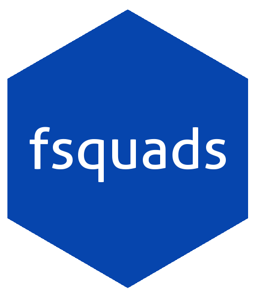

# fsquads 

## Introduction

This is an R package for retrieving data from
<http://www.footballsquads.co.uk>.

### Installation

`devtools::install_github('tonyelhabr/fsquads')`.

## Quick Reference

    #> get_league_teams_meta
    #> get_leagues_meta
    #> get_team_players

## TODO

\[ \] Remove dependencies.

\[ \] Re-consider the need for memoization.

\[ \] Make better documentation.

\[ \] Add functions for retrieving national competition data (from
<http://www.footballsquads.co.uk./national.htm>).

## Examples

Unfortunately, none (right now).
